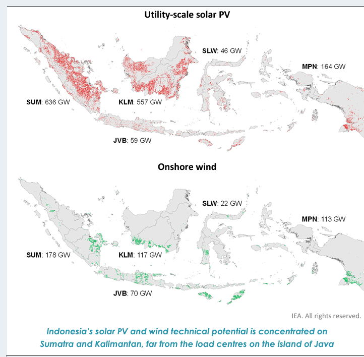

# **Indonesia model**

[[_TOC_]]

The history of the Indonesia model is that it began as a plant-level model based on country-level work with MEMR, concentrating on 2025/2030 in Java-Bali & Sumatra only. However, at the same time WEO started work on the NZE Roadmap for Indonesia, and so the model was built with the flexibility to be both a WEO-style (technology aggregated) and country-level-style (plant-level, smaller plants and RE aggregated) model.

Both models are housed in the same XML file, with the level of detail being controlled by various scenarios in PLEXOS itself.

All data can be found at the Y: (\\\\vfilermc1\\EMS\\) drive here: Y:\\Modelling\\Indonesia\\2021_IPSE\\01_Data

# **Indonesia Power System Enhancement (IPSE) model**

**Technical annex draft (**[Indonesia PSE Technical Annex Model.docx](https://ieaorg.sharepoint.com/:w:/r/sites/EMS-RISE/Shared%20Documents/Indonesia/Phase%202%20(2021-2022)/05%20Report/03%20Draft/Indonesia%20PSE%20Technical%20Annex%20Model.docx?d=wcc79a1f291e345ea862a1118457b0e7b&csf=1&web=1&e=91kIPp))

Report: https://www.iea.org/reports/enhancing-indonesias-power-system

##### **Data sources**

* The modelling of the power systems in Java-Bali and Sumatra is predominantly based on data requested and received from Indonesian stakeholders (the MEMR and PLN) with key information on the different components of the power system. In the absence of specific data for either Indonesia or a specific component of the power system, either public domain information or assumptions based on best-practice were made to allow for completeness of the model.

##### **Regions**

* Only Sumatra and Java-Bali were modelled. The Java-Bali and Sumatra systems are disaggregated into five and two regions, respectively. For the Java-Bali system, the modelling regions are in accordance with the control regions of PLN, while for the Sumatra system, two regions are assumed: North (SMN) and South (SMS), based on the provinces and the location of the key bottleneck in the north-south 275 kV transmission corridor between Jambi and Sumetara Barat provinces. The high-level transmission network topologies (150 kV, 275 kV and 500 kV) connecting different operating regions are modelled. In 2025, the Sumatra and Java-Bali systems will still not be interconnected and will therefore be operated independently of one another.

  {width="437" height="437"}

##### **Scenarios**

* The study is based on the planned systems in Java-Bali and Sumatra in 2025 as per the [Electricity Business Plan (RUPTL 2021)](https://gatrik.esdm.go.id/assets/uploads/download_index/files/38622-ruptl-pln-2021-2030.pdf) that aims to achieve the national renewable target of a 23% share of renewables in the electricity mix by 2025. Therefore, the supply and demand outlook as per the RUPTL in 2025 form the basis of the model and the Reference or **Base Scenario** apart from one notable exception: the share of biomass in the electricity mix in the Base Scenario is 2.2% (against 3.5% in the RUPTL) although the installed capacities are the same. With a level of bioenergy contribution as in the RUPTL, the 23% target would not be achieved. Since co-firing takes place in PLN’s coal plants at the blending ratio of 10%, reaching the RUPTL bioenergy share requires a yearly capacity factor of those plants (with a capacity of around 12 GW) around 80%, leading to an even greater share of coal-fired power and higher fuel costs. In contrast, the Base Scenario assumes economic dispatch of the thermal fleet with contractual constraints.
* In addition to the Base Scenario in 2025, the analysis considers additional scenarios that explore different pathways for Indonesia to meets its renewables target in 2025. The additional scenarios revolve around the following main sensitivities:

  1)    Renewables mix, based on both the status and lead-time of renewable technologies in the RUTPL and ensuring that Indonesia meets its renewable targets for 2025

  2)    Additional demand due to electrification of new end-uses (clean cooking and electric vehicles)

  3)    Contractual constraints on thermal plants which limit their flexibility

  <table>
  <tr>
  <td>

  **Scenario**
  </td>
  <td>

  **Electricity mix**
  </td>
  <td>

  **Storage and EVs**
  </td>
  <td>

  **Demand**
  </td>
  <td>

  **Share of RE (VRE)**
  </td>
  </tr>
  <tr>
  <td>2025 Enforced co-firing</td>
  <td>RUPTL</td>
  <td>RUPTL</td>
  <td>RUPTL</td>
  <td>23% RE (1.9% VRE)</td>
  </tr>
  <tr>
  <td>

  **2025 Base**
  </td>
  <td>

  RUPTL  (with economic dispatch of co-firing)
  </td>
  <td>RUPTL</td>
  <td>RUPTL</td>
  <td>22% RE (1.9% VRE)</td>
  </tr>
  <tr>
  <td>2025 Without co-firing</td>
  <td>No Co-firing</td>
  <td>RUPTL</td>
  <td>RUPTL</td>
  <td>20% RE (1.9% VRE)</td>
  </tr>
  <tr>
  <td>

  **2025 SolarPlus**
  </td>
  <td>

  No co-firing

  High share of solar PV
  </td>
  <td>RUPTL</td>
  <td>RUPTL</td>
  <td>25% RE (10% VRE)</td>
  </tr>
  <tr>
  <td>

  2025 SolarPlus  + Clean cooking
  </td>
  <td>

  No co-firing

  High share of solar PV
  </td>
  <td>RUPTL</td>
  <td>Clean cooking</td>
  <td>

   25% RE (10% VRE)

   
  </td>
  </tr>
  <tr>
  <td>

  2025 SolarPlus  + EVs
  </td>
  <td>

  No co-firing

  High share of solar PV
  </td>
  <td>EVs</td>
  <td>RUPTL</td>
  <td>25% RE (10% VRE)</td>
  </tr>
  <tr>
  <td>

  2025 SolarPlus  + Clean cooking + EVs
  </td>
  <td>

  No co-firing

  High share of solar PV
  </td>
  <td>EVs</td>
  <td>Clean cooking</td>
  <td>25% RE (10% VRE)</td>
  </tr>
  <tr>
  <td>

  2025 SolarPlus

  With contractual flexibility
  </td>
  <td>

  No co-firing

  High share of solar PV

  Thermal plants contractual flexibility
  </td>
  <td>RUPTL</td>
  <td>RUPTL</td>
  <td>28% RE (10% VRE)</td>
  </tr>
  </table>

   
* **Enforced co-firing:** This scenario is the most compliant with the plans in the RUPTL. The coal-fired plants where biomass co-firing takes place (owned by PLN, with a capacity of 12 GW) are forced to run at least 80% of the time to equal the bioenergy share in final energy in the RUPTL.
* **Without** **co-firing:** This scenario assumes that biomass co-firing is not yet possible in 2025 due to either fuel supply logistics, or other technical reasons that would prevent the designated coal-fired capacity to co-fire the expected 10% biomass in coal plants for generation purposes. In this scenario, the capacity assigned to co-firing in the RUPTL 2021 is therefore maintained as normal coal capacity and those plants are not forced to run to meet a given capacity factor.
* **SolarPlus:** This scenario assumes that all non-committed generation capacity from the RUPTL 2021 (according to the unfulfilled government quota) for deployment up until 2025 is replaced with utility-scale solar PV generation of approximately the same energy output. Similar to the No Co-firing Scenario, biomass co-firing is maintained as coal capacity. In addition, most of the non-committed generators are geothermal and hydropower plants, and hence are regarded as a large uncertainty in Indonesia’s ability to meet its national renewable target of 23% by 2025 due to long lead times. This scenario therefore leads to a solar PV capacity of 18 GW[\[1\]](#\_ftn1) for the combined systems of Java-Bali and Sumatra.

**Generation**

The generation mix in Java in 2025 is based on the planned retirements and new builds from the [RUPTL 2021](https://gatrik.esdm.go.id/assets/uploads/download_index/files/38622-ruptl-pln-2021-2030.pdf). All plants (existing and future) are consolidated in the IDN_Plant_level tab found in the generator capacity/parameters workbook.

In addition to the standard parameters, several specific features were used for this model and in the data collected:

1. Constraints in PPAs with coal IPPs and take-or-pay contracts for the supply of gas are implemented using assumptions derived from historical (2019) data. The annual minimum offtake for coal IPPs (set to 60%) was based on the range of capacity factors of IPPs in 2019 in both Java-Bali and Sumatra while allowing the simulation outcomes for the Base Scenario in 2025 to meet the renewables target. Gas contracts are assumed to include daily take-or-pay obligations at the regional level scaled up from the 2019 consumption according to the capacity growth of gas-fired plants.
2. Co-firing of biomass (wooden pellets and agriucultural residue) and coal was used. This is furrther built upon in the NZE work
3. Certain gas plants were relocated from JVB to other islands. These were therefore marked as "Relocated" in the data

##### **Demand**

**Baseline demand** is based on the annual demand values for 2019 and 2025 from RUPTL. The modelling only considered the on-grid connected values, estimated based on the share of connected capacity in RUPTL.

As the government strategy aims at reducing the use of oil products in final energy consumption through electrification of cooking (in replacement of traditional biomass and LPG) and road transport, these new end-uses were modelled for 2025 in our electrification scenarios.

###### Electric Vehicle

Electric vehicles are part of the government strategy, but RUPTL 2021 did not include any significant role for them. Published after the RUPTL 2021, the National Energy Board provided targets for 4-wheelers (0.125 kWh.km) and 2/3-wheelers (0.03 kWh/km), with estimated daily vehicle-km of 49 and 22 respectively.

In our model, national targets are disaggregated based on population after identifying the most relevant factor via linear regression with car and 2/3-wheeler ownership from BPS ([Percentage of Households by Province and Motor Vehicle Ownership](https://www.neliti.com/publications/51282/percentage-of-households-by-province-and-motor-vehicle-ownership-2013)). The daily load profile is based on a typical charging behaviour compiled from [GEVO (IEA, 2020)](https://www.iea.org/reports/global-ev-outlook-2020).

Percentage of daily loads for different vehicles and charging type

###### Electric Cooking

While electric cooking is part of the government strategy, no clear targets are laid out in RUPTL 2021. The forecasted electricity consumption will depend on the different stocks expected per province, as well as the consumption efficiency. As there is no clear targets from the Indonesian government, hence the basis is the consumption is from the IEA’s **Sustainable Development Scenario**. This represents approximately 20% penetration in households.

National data is disaggregated based on population after identifying it as the most relevant factor via linear regression with the estimated electric cooking stock in the different provinces. The cooking stock is estimated using household by province x share of electric cooking stock in surveyed households from BPS [Household Cooking Fuel](https://www.bps.go.id/statictable/2014/09/10/1364/persentase-rumah-tangga-menurut-provinsi-dan-bahan-bakar-utama-untuk-memasak-tahun-2001-2007-2016.html))

The daily use of electric cooking is based on a recorded use of rice cookers in Japan by [Shimoda et al (2003)](https://www.semanticscholar.org/paper/DEVELOPMENT-OF-RESIDENTIAL-ENERGY-END-USE-MODEL-AT-Shimoda-Fujii/224d814df091b2f1680d5b249ea562fc7f385e51/figure/3) which has been used by LBNL by [Letschert (2019)](https://www.sciencedirect.com/science/article/pii/S0973082618312559) in their Bottom-Up Energy Analysis Model.

##### **VRE profiles**

* VRE profiles were based fully on ERA5 data using the RISE-developed site selection and profile construction metodology (the precursor to the gis-script). The exacty methodology is detailed in the technical annex of IPSE.

##### Transmission

Inter-regional transmission lines between the modelled regions (i.e. control regions in Java-Bali and the North/South of Sumatra are considered, however only in terms of their transfer capacity. The export/import limits of these lines are based on assumed values of power capacity considering the voltage level and configuration of lines. Transmission expansion between 2019 and 2025 is assumed based on RUPTL.

# **Indonesia NZE roadmap model**

**Report**: https://www.iea.org/reports/an-energy-sector-roadmap-to-net-zero-emissions-in-indonesia, Chapter 5.3

##### **Regions**

* A WEO-style model with 5 regions for each main island group (Java-Bali, Sumatra, Kalimantan, Sulawesi and Maluku-Papua-Nesa Tanggura). While these islands also consist of smaller islands (and with MPN, it is a collection of many), it is assumed that these regions have a copper-plate internally
* 

##### **Scenarios**:

* The model consists of two different capacity scenarios (STEPS and APS) and two different years (2035 and 2050), with these inputs coming directly from the WEO. Additionally, a capacity expansion model was used to address

##### **Generation**:

* Capacities come directly from WEO, with this working being done directly in parallel with their own modelling work. Only power plant capacity was provided, with their ability to assess system flexibility being limited at the time. This meant that our model was required to provide key inputs of the necessary battery capacity (including composition of different duration storage) to operate reliabily.
* Generation capacity numbers are found in the "NZE_Exp_by_Reg" tab, having come from the WEO data provided directly.
* The regional split of generation capacity technologies across these 5-regions for conventional technologies is based on analysis of existing and future generation capacities in these regions (considering the RUPTL) - see "NZE_Regional_Split" tab. VRE was based on the site selection methodology detailed below.

##### **Demand**:

* The demand profile comes from the WEO, containing the bottom up end use disaggregation. The regional demand disaggregation was based on RUKN demand projections which came directly from MEMR as part of our data collection, thanks to the IPSE work.

##### **Transmission**:

* As a very spread out islanded system, there is currently no interconnection of the different modelled regions, though there were at the time of the modelling, plans to build a 1GW IC between JVB and Sumatra. Therefore, this was assumed to be in service for our models. For the remaining transmission, this was based on model results from capacity expansion planning which allowed the model to find an optimal mix of new transmission (HVDC undersea cables) and batteries. New transmission, besides the 1GW JVB-SUM link, was deeemd to not be feasible by 2030, and only included in 2050.

##### **VRE profiles**:

* VRE profiles were based fully on ERA5 data using the RISE-developed site selection and profile construction metodology (the precursor to the gis-script). The exacty methodology is detailed in the report as it formed a chapter which analysed the technical potential.
* In the case of the split of VRE per region/island, this was based on the **DEA RE pipeline (**see **VRE_by_ISL** tab**).** In the 2050 scenario, this split however exceeds the technical potential in JVB, in which case the methodology allowed for the this to be reassigned to Sumatra's capacity. The expansion of transmission between islands is key for this system to work.

  {width=589 height=577}