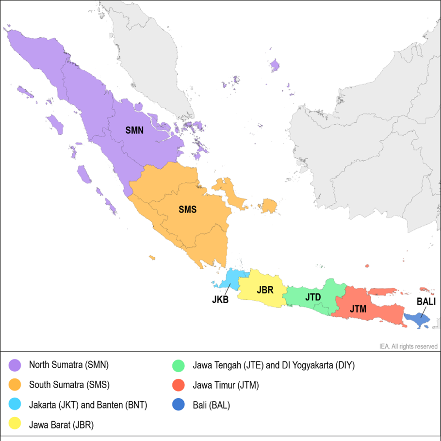
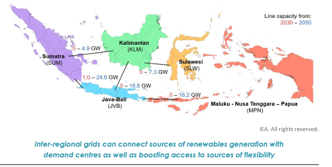

# **Indonesia model**

The history of the Indonesia model is that it began as a plant-level model based on country-level work with MEMR, concentrating on 2025/2030 in Java-Bali & Sumatra only. However, at the same time WEO started work on the NZE Roadmap for Indonesia, and so the model was built with the flexibility to be both a WEO-style (technology aggregated) and country-level-style (plant-level, smaller plants and RE aggregated) model.

Both models are housed in the same XML file, with the level of detail being controlled by various scenarios in PLEXOS itself. 

All data can be found here: Y:\\Modelling\\Indonesia\\2021_IPSE\\01_Data

# **Indonesia Power System Enhancement (IPSE) model**

**Technical annex draft (**[Indonesia PSE Technical Annex Model.docx](https://ieaorg.sharepoint.com/:w:/r/sites/EMS-RISE/Shared%20Documents/Indonesia/Phase%202%20(2021-2022)/05%20Report/03%20Draft/Indonesia%20PSE%20Technical%20Annex%20Model.docx?d=wcc79a1f291e345ea862a1118457b0e7b&csf=1&web=1&e=91kIPp))

* **Data sources:** The modelling of the power systems in Java-Bali and Sumatra is predominantly based on data requested and received from Indonesian stakeholders (the MEMR and PLN) with key information on the different components of the power system. In the absence of specific data for either Indonesia or a specific component of the power system, either public domain information or assumptions based on best-practice were made to allow for completeness of the model.

* **Regions**: Only Sumatra and Java-Bali were modelled. The Java-Bali and Sumatra systems are disaggregated into five and two regions, respectively. For the Java-Bali system, the modelling regions are in accordance with the control regions of PLN, while for the Sumatra system, two regions are assumed: North (SMN) and South (SMS), based on the provinces and the location of the key bottleneck in the north-south 275 kV transmission corridor between Jambi and Sumetara Barat provinces. The high-level transmission network topologies (150 kV, 275 kV and 500 kV) connecting different operating regions are modelled. In 2025, the Sumatra and Java-Bali systems will still not be interconnected and will therefore be operated independently of one another.

  {width=437 height=437}

##### **Scenarios**

* The study is based on the planned systems in Java-Bali and Sumatra in 2025 as per the  [Electricity Business Plan (RUPTL 2021)](https://gatrik.esdm.go.id/assets/uploads/download_index/files/38622-ruptl-pln-2021-2030.pdf) that aims to achieve the national renewable target of a 23% share of renewables in the electricity mix by 2025. Therefore, the supply and demand outlook as per the RUPTL in 2025 form the basis of the model and the Reference or **Base Scenario** apart from one notable exception: the share of biomass in the electricity mix in the Base Scenario is 2.2% (against 3.5% in the RUPTL) although the installed capacities are the same. With a level of bioenergy contribution as in the RUPTL, the 23% target would not be achieved. Since co-firing takes place in PLN’s coal plants at the blending ratio of 10%, reaching the RUPTL bioenergy share requires a yearly capacity factor of those plants (with a capacity of around 12 GW) around 80%, leading to an even greater share of coal-fired power and higher fuel costs. In contrast, the Base Scenario assumes economic dispatch of the thermal fleet with contractual constraints.
* In addition to the Base Scenario in 2025, the analysis considers additional scenarios that explore different pathways for Indonesia to meets its renewables target in 2025. The additional scenarios revolve around the following main sensitivities:

  1)    Renewables mix, based on both the status and lead-time of renewable technologies in the RUTPL and ensuring that Indonesia meets its renewable targets for 2025

  2)    Additional demand due to electrification of new end-uses (clean cooking and electric vehicles)

  3)    Contractual constraints on thermal plants which limit their flexibility

  <table>
  <tr>
  <td rowspan="2">

  **Scenario**
  </td>
  <td rowspan="2">

  **Electricity mix**
  </td>
  <td rowspan="2">

  **Storage and EVs**
  </td>
  <td rowspan="2">

  **Demand**
  </td>
  <td>

  **Share of RE (VRE)**
  </td>
  </tr>
  <tr>
  <td>

  **Sumatra and Java-Bali**
  </td>
  </tr>
  <tr>
  <td>2025 Enforced co-firing</td>
  <td>RUPTL</td>
  <td>RUPTL</td>
  <td>RUPTL</td>
  <td>23% RE (1.9% VRE)</td>
  </tr>
  <tr>
  <td>

  **2025 Base**
  </td>
  <td>

  RUPTL  (with economic dispatch of co-firing)
  </td>
  <td>RUPTL</td>
  <td>RUPTL</td>
  <td>22% RE (1.9% VRE)</td>
  </tr>
  <tr>
  <td>2025 Without co-firing</td>
  <td>No Co-firing</td>
  <td>RUPTL</td>
  <td>RUPTL</td>
  <td>20% RE (1.9% VRE)</td>
  </tr>
  <tr>
  <td>

  **2025 SolarPlus**
  </td>
  <td>

  No co-firing

  High share of solar PV
  </td>
  <td>RUPTL</td>
  <td>RUPTL</td>
  <td>25% RE (10% VRE)</td>
  </tr>
  <tr>
  <td>

  2025 SolarPlus  + Clean cooking
  </td>
  <td>

  No co-firing

  High share of solar PV
  </td>
  <td>RUPTL</td>
  <td>Clean cooking</td>
  <td>

   25% RE (10% VRE)

   
  </td>
  </tr>
  <tr>
  <td>

  2025 SolarPlus  + EVs
  </td>
  <td>

  No co-firing

  High share of solar PV
  </td>
  <td>EVs</td>
  <td>RUPTL</td>
  <td>25% RE (10% VRE)</td>
  </tr>
  <tr>
  <td>

  2025 SolarPlus  + Clean cooking + EVs
  </td>
  <td>

  No co-firing

  High share of solar PV
  </td>
  <td>EVs</td>
  <td>Clean cooking</td>
  <td>25% RE (10% VRE)</td>
  </tr>
  <tr>
  <td>

  2025 SolarPlus

  With contractual flexibility
  </td>
  <td>

  No co-firing

  High share of solar PV

  Thermal plants contractual flexibility
  </td>
  <td>RUPTL</td>
  <td>RUPTL</td>
  <td>28% RE (10% VRE)</td>
  </tr>
  </table>

   
* **Enforced co-firing:** This scenario is the most compliant with the plans in the RUPTL. The coal-fired plants where biomass co-firing takes place (owned by PLN, with a capacity of 12 GW) are forced to run at least 80% of the time to equal the bioenergy share in final energy in the RUPTL.
* **Without** **co-firing:** This scenario assumes that biomass co-firing is not yet possible in 2025 due to either fuel supply logistics, or other technical reasons that would prevent the designated coal-fired capacity to co-fire the expected 10% biomass in coal plants for generation purposes. In this scenario, the capacity assigned to co-firing in the RUPTL 2021 is therefore maintained as normal coal capacity and those plants are not forced to run to meet a given capacity factor.
* **SolarPlus:** This scenario assumes that all non-committed generation capacity from the RUPTL 2021 (according to the unfulfilled government quota) for deployment up until 2025 is replaced with utility-scale solar PV generation of approximately the same energy output. Similar to the No Co-firing Scenario, biomass co-firing is maintained as coal capacity. In addition, most of the non-committed generators are geothermal and hydropower plants, and hence are regarded as a large uncertainty in Indonesia’s ability to meet its national renewable target of 23% by 2025 due to long lead times. This scenario therefore leads to a solar PV capacity of 18 GW[\[1\]](#\_ftn1) for the combined systems of Java-Bali and Sumatra.

##### \
**Generation**: 

The generation mix in Java in 2025 is based on the planned retirements and new builds from the [RUPTL 2021](https://gatrik.esdm.go.id/assets/uploads/download_index/files/38622-ruptl-pln-2021-2030.pdf). These plants consist of various generation technologies which are defined according to a number of techno-economic characteristics and operating constraints which are based on either information provided by PLN or, in its absence, industry-best practice. Broadly speaking, and in the context of Indonesia, these can be divided into conventional thermal, hydro, and solar PV. In general, the following parameters of the aforementioned plants are modelled:

Ÿ  Minimum stable level

Ÿ  Run-up rates

Ÿ  Ramp rates

Ÿ  Average heat rates

Ÿ  Outage rates (both forced and maintenance) with mean time to repair (MTTR)

Ÿ  Minimum up and down times

Ÿ  Average start-up costs

Ÿ  Variable Operation & Maintenance (O&M) costs

In addition to the abovementioned characteristics, the fuels used by specific generators or sets thereof are also modelled. This includes the fuel prices (as expanded upon in the following section pertaining to data) and fuel constraints.

As it relates to hydro, generators are separated into one of four groups:

Ÿ  Run-of-river (RoR) plants with daily pondage schemes

Ÿ  Plants with large reservoirs

Ÿ  Off-stream (standalone) pumped storage hydro (PSH) schemes

Ÿ  Pump-back PSH schemes

Constraints in PPAs with coal IPPs and take-or-pay contracts for the supply of gas are implemented using assumptions derived from historical (2019) data. The annual minimum offtake for coal IPPs (set to 60%) was based on the range of capacity factors of IPPs in 2019 in both Java-Bali and Sumatra while allowing the simulation outcomes for the Base Scenario in 2025 to meet the renewables target. Gas contracts are assumed to include daily take-or-pay obligations at the regional level scaled up from the 2019 consumption according to the capacity growth of gas-fired plants.

##### **Demand**: 

**Baseline demand** is based on the annual demand values for 2019 and 2025 from RUPTL. The modelling only considered the on-grid connected values, estimated based on the share of connected capacity in RUPTL.

As the government strategy aims at reducing the use of oil products in final energy consumption through electrification of cooking (in replacement of traditional biomass and LPG) and road transport, these new end-uses were modelled for 2025 in our electrification scenarios.

#### Electric Vehicle

Electric vehicles are part of the government strategy, but RUPTL 2021 did not include any significant role for them. Published after the RUPTL 2021, the National Energy Board provided targets for 4-wheelers (0.125 kWh.km) and 2/3-wheelers (0.03 kWh/km), with estimated daily vehicle-km of 49 and 22 respectively.

In our model, national targets are disaggregated based on population after identifying the most relevant factor via linear regression with car and 2/3-wheeler ownership from BPS ([Percentage of Households by Province and Motor Vehicle Ownership](https://www.neliti.com/publications/51282/percentage-of-households-by-province-and-motor-vehicle-ownership-2013)). The daily load profile is based on a typical charging behaviour compiled from [GEVO (IEA, 2020)](https://www.iea.org/reports/global-ev-outlook-2020).

Percentage of daily loads for different vehicles and charging type

{width="582" height="282"}

#### Electric Cooking

While electric cooking is part of the government strategy, no clear targets are laid out in RUPTL 2021. The forecasted electricity consumption will depend on the different stocks expected per province, as well as the consumption efficiency. As there is no clear targets from the Indonesian government, hence the basis is the consumption is from the IEA’s **Sustainable Development Scenario**. This represents approximately 20% penetration in households.

National data is disaggregated based on population after identifying it as the most relevant factor via linear regression with the estimated electric cooking stock in the different provinces. The cooking stock is estimated using household by province x share of electric cooking stock in surveyed households from BPS [Household Cooking Fuel](https://www.bps.go.id/statictable/2014/09/10/1364/persentase-rumah-tangga-menurut-provinsi-dan-bahan-bakar-utama-untuk-memasak-tahun-2001-2007-2016.html))

The daily use of electric cooking is based on a recorded use of rice cookers in Japan by [Shimoda et al (2003)](https://www.semanticscholar.org/paper/DEVELOPMENT-OF-RESIDENTIAL-ENERGY-END-USE-MODEL-AT-Shimoda-Fujii/224d814df091b2f1680d5b249ea562fc7f385e51/figure/3) which has been used by LBNL by [Letschert (2019)](https://www.sciencedirect.com/science/article/pii/S0973082618312559) in their Bottom-Up Energy Analysis Model.

* The demand profile comes from the WEO, containing the bottom up end use disaggregation. The regional demand disaggregation was based on RUKN demand projections which came directly from MEMR as part of our data collection, thanks to the IPSE work.
* **Transmission**: As a very spread out islanded system, there is currently no interconnection of the different modelled regions, though there were at the time of the modelling, plans to build a 1GW IC between JVB and Sumatra. Therefore, this was assumed to be in service for our models. For the remaining transmission, this was based on model results from capacity expansion planning which allowed the model to find an optimal mix of new transmission (HVDC undersea cables) and batteries. New transmission, besides the 1GW JVB-SUM link, was deeemd to not be feasible by 2030, and only included in 2050.
* **VRE profiles**: VRE profiles were based fully on ERA5 data using the RISE-developed site selection and profile construction metodology (the precursor to the gis-script). The exacty methodology is detailed in the technical annex of IPSE.

# **Indonesia NZE roadmap model**

* **Regions**: A WEO-style model with 5 regions for each main island group (Java-Bali, Sumatra, Kalimantan, Sulawesi and Maluku-Papua-Nesa Tanggura). While these islands also consist of smaller islands (and with MPN, it is a collection of many), it is assumed that these regions have a copper-plate internally.   
* **Scenarios**: The model consists of two different capacity scenarios (STEPS and APS) and two different years (2035 and 2050), with these inputs coming directly from the WEO. Additionally, a capacity expansion model was used to address 
* **Generation**: Capacities come directly from WEO, with this working being done directly in parallel with their own modelling work. Only power plant capacity was provided, with their ability to assess system flexibility being limited at the time. This meant that our model was required to provide key inputs of the necessary battery capacity (including composition of different duration storage) to operate reliabily. 
* **Demand**: The demand profile comes from the WEO, containing the bottom up end use disaggregation. The regional demand disaggregation was based on RUKN demand projections which came directly from MEMR as part of our data collection, thanks to the IPSE work.
* **Transmission**: As a very spread out islanded system, there is currently no interconnection of the different modelled regions, though there were at the time of the modelling, plans to build a 1GW IC between JVB and Sumatra. Therefore, this was assumed to be in service for our models. For the remaining transmission, this was based on model results from capacity expansion planning which allowed the model to find an optimal mix of new transmission (HVDC undersea cables) and batteries. New transmission, besides the 1GW JVB-SUM link, was deeemd to not be feasible by 2030, and only included in 2050.
* **VRE profiles**: VRE profiles were based fully on ERA5 data using the RISE-developed site selection and profile construction metodology (the precursor to the gis-script).  The exacty methodology is detailed in the technical annex of IPSE. 

# **2024 EFC project** 

(TODO: Ed to add)

# **2024 EFC project handover summer 2024**

* Demand:
  * All WEO inputs are saved in the Load folder along with combined demand inputs, which contains everything that goes into the model. The 'RegionalFactors' sheets for 2022 and 2030 are the ones that need to be updated with the demand splits for the new regions.
  * Status:
    * The hourly end use profiles from WEO contain negative values so we need to ask them about it
    * Changed the model to 7 nodes
    * Added new end uses to match the WEO demand
      * Code was created in [plexos-model-setup](https://gitlab.iea.org/iea/ems/rise/plexos-model-setup) (LoadSetup class) to create the PLEXOS inputs from the new formats saved in the combined demand inputs sheet
      * Needs to be tested to make sure it runs properly
      * EVs in the model are now called Shift12h (to match the index) but they are still represented with daily limits as are 10h and 24h end uses
      * Some extra headers were added to the demand response index (Shed4h/Shift8h) for end uses with no shift or shed potential to avoid file errors for the old purchasers (it just creates 0 columns with those names), but the purchasers could be deleted in PLEXOS and then these could be removed
    * Demand/generation totals from the PLEXOS run still need to be checked against the WEO extended dataset
  * Regarding the new regional splits, in principle the main data is tracked here.
    * Looking at it, I'm not convinced that we can find anywhere the projections themselves by province as I think they were aggregated before projection or in some cases only ever developed at the regional level. In this case, rather than redoing the projection, as a simplification I would suggest:
      * Try to obtain the electricity demand / electricity sales by province for 2022
      * Use this to effectively subtract and add provinces from the regions in the split I did here by assuming they take an even proportion of all end uses so that the new regions are the right size in demand even if the end use split is not perfect
      * Do the same for the future year, or adjust the proportions up or down slightly for end uses if you think the separated provinces have stronger or weaker growth prospects. Again it should mean the regions have about the right size even if the end use split is not perfect, which in the end is the most important. For residential you could use the projections in the population tab in this excel sheet for guidance to adjust the future split. For services and industrial, these were only ever estimated on the regional level and it seems to be based on expert opinion, so I think we can justify adjusting the proportions slightly manually if it seems appropriate based on the information or expectations we have.
* Generation capacity and properties:
  * The generator parameters sheet contains all the model inputs and is saved in the power plants folder with the various files used to create it.
    * The PLEXOS input files are created by this R script. It should only need to be pointed to the latest version of the generator parameters sheet and can be used to remake the input files any time parameters is updated.
    * The RegionSplit sheet in generator parameters is the one that needs to be updated to change the regional split of generation technologies. If a more granular split is desired (e.g. by individual plant type), the 'Category' column can be swapped for any of the index columns in 'all model indices' found in the gitlab folder and code will automatically match on the column name.
      * We can use the current data we have on generation by province to adjust the split for today (ideally mid or end 2022) and then the future splits could be guided by the previous project but suggest for Jiepeng to look into it and again we aim to maintain regional generation adequacy while starting from the current status and adjusting capacity from there to match the future numbers from WEO.
  * Plant list with capacities is created by the CapacitySetup class in the [plexos-model-setup](https://gitlab.iea.org/iea/ems/rise/plexos-model-setup) in gitlab.
    * This is then pasted into the generator parameters sheet in the 'ScaledCapacities' tab as the RawCapacity
    * Currently, a manually created table of Maximum Capacities (derived from the China PSO 2019 project) is pasted in the same tab to represent the maximum unit capacity.
    * The class now also creates a table of efficiencies for pasting into generator parameters (in the LHVs tab). This was set up last minute so it needs some checking but it uses the first product/flow combination from all model indices (found in the templates and indices in the model setup gitlab) to match the plant technologies to the efficiency values in the DW (some plants are constructed from multiple product/flows so not 100% sure if this is correct in every instance).
  * The calculations in the Overview tabs have been checked to some degree but there could be errors and in general everything should be checked in the model runs to make sure the value ranges make sense
    * The lookups for the fair dispatch assumptions were fixed to deal with the new plant technologies
      * Should check that the mapping for the new technologies (Indices tab, FDtech column) makes sense
    * The heat rate had to be fixed (using the efficiency table above)
    * CHP setup should be checked that it is working/makes sense
  * A couple of files had been created ad hoc in the previous project for the parameters sheet and PLEXOS inputs so this was redone for the new technologies. The code is in the gitlab folder in /project scripts/China/2024_China_EFC/China 2024 EFC ad hoc code.py. Files created were:
    * Max capacity by tech type for pasting into the generator parameters sheet. This was based on regional maxes from the previous model with the technologies mapped based on the index so it could be good to check it and potentially update if there are any issues.
    * PLEXOS input file CHPminCFhour which is used in the new CHP setup which was used to fix the issues with CHP not working correctly in the older model
  * Capacity totals from the PLEXOS model still need to be checked against WEO extended data (note that due to the capacity derating approach ours should be lower. There are tabs in the parameters sheet (Installed Summary for checks and InstalledCheck for pasting the PLEXOS solution file data direct from PLEXOS) that could be updated to check the derated and non-derated capacities to check that non-derated matches WEO extended data and the derated adjustment is correct and aligned with the PLEXOS model.
* Transmission
  * The active setup being used in the previous project was only using simplified lines representing the entire corridor between regions with one line. To update we would therefore only need the aggregate capacities in each direction
  * So far this has only been updated by removing the lines involving NSR, so the capacities and potentially the linkages between regions would need to be adjusted to reflect the new 7-node setup
* VRE profiles
  * It might be worth discussing with WEO what they have now (they recently redid the generation data analysis and I think they have something new for China) and if it could be better for us to take data from them to be more aligned.
  * Current profiles have simply been inherited from the previous project. Ideally at least the old data, saved in this folder, would be remapped to the new regional setup. The original indexing of the 2000 sites to the regions can be found here for solar and here for wind, and this script used for reprocessing the data for the adequacy project that accessed these and the data could provide a starting point.
* Prices
  * There is data for coal, oil, gas provided by WEO in the DW. Basic fuel prices were set up in the model using a manual sheet to create the input files based on the DW data. For coal past regional variation was applied with the (flat) average equal to the new WEO value. Some numbers stolen from Ukraine for 0000000000000000000000000000000000000000000000Low C fuels - ideally might be improved specifically for China
* Reserves
  * These were copied over from the previous project and need to be updated for the new demand, generation, regional split, etc.

 

 