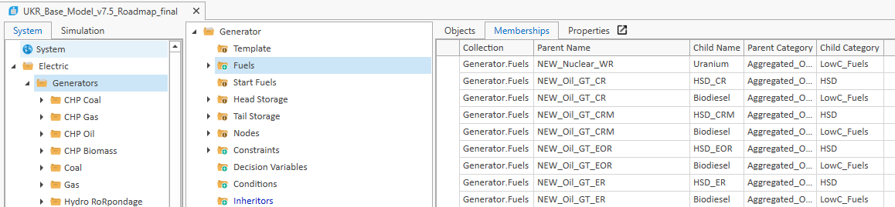
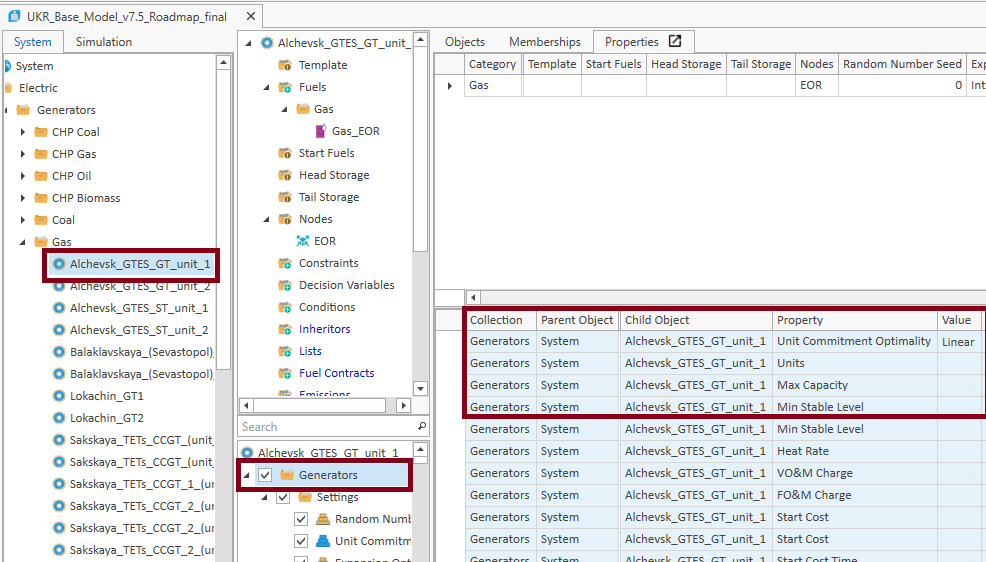
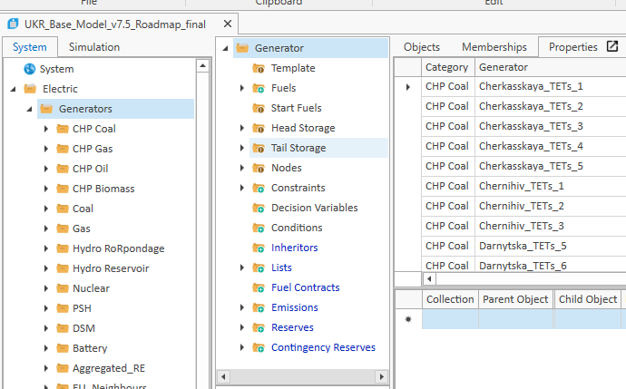

The following represents the general modelling workflow and a checklist for when you are preparing a new model in PLEXOS.

The PLEXOS model itself will consist of the following components:

[[_TOC_]]

## Starting a new model

- Create a new folder in the relevant country folder in Y:\\Modelling (for a new one) and then create inside it the folder structure according to the modelling folder structure section.
- Copy the base model file to use as a basis into the 03_Modelling folder and give it a new name
- Create the '01_InputData' folder inside the 03_Modelling folder to eventually contain the PLEXOS input file
- Since the development of the [plexos-model-setup](https://gitlab.iea.org/iea/ems/rise/plexos-model-setup) package, this has become the central piece of the model setup in terms of generation data.
- **NOTE:** For WEO-based projects, the data (both demand and generation) need to be requested from WEO (e.g. Brent + Davide (PSU) for generation and Stephanie (DSU) for demand data) well in advance.
- Note that we should make sure that the unit head or at a minimum the project lead has already informed WEO about the project (and they didn't raise objections) prior to making data requests (suggest that the unit head informs Laura Cozzi and Brent well in advance of actually working on the model so that they can raise any concerns such as potential overlaps or clashes with WEO projects before timelines and deliverables are fixed).
- Note that WEO data is generally at a regional level. In some cases (China, India, Indonesia, South Africa), these regions may correspond to a a country. In other cases, WEO may have a representation at a country-level that is not published (e.g. Korea) though this is rare and often requires effort from WEO.

## Generation

### Overview

Generation data for a project will come from either country-level sources (direct stakeholders) or from WEO projections. As WEO projections are, at best, at a national level, this will require some capacity splitting. For country-level data, this should be requested with regional information to allow the assignment of generators to specific regions.

Capacity splitting for existing generation should be based on data collected on the existing regional split, either from contacts in the country or public domain information.

For the split of generation in the future power system, this will depend on both the retirement of existing generation and the building of new resources. Ideally, you would account for these separately. Though not built into the current tool for obtaining capacity, WEO can provide data on retirements which could be split based on existing generation split (as an example).

For new generation, the regional splitting factor should be based on available resources around, for example:

1. Capacity expansion plans
2. Forecasts for TDPs and other plans (e.g. ERRA or TYNDP in Europe)
3. Project pipelines

Generation data should be provided in a standard format that allows matching to the [**model indices**](https://gitlab.iea.org/iea/ems/rise/plexos-model-setup/-/blob/main/templates%20and%20indices/all%20model%20indices.csv?ref_type=heads) as per the template provided in [plexos-model-setup](https://gitlab.iea.org/iea/ems/rise/plexos-model-setup) package. Generator parameters (as per the Indices tab of the generator_parameters template file found in the [templates and indices](https://gitlab.iea.org/iea/ems/rise/plexos-model-setup/-/tree/main/templates%20and%20indices?ref_type=heads) folder) are used for create generic properties of generators based on technology class. These should be reviewed and updated per project.

For plant-level data (i.e. for country-level generation parameters) these should be provided with the right column name (as per generator_parameters template file) and specified as plant-level parameters in the configuration file (TOML).

### Steps

1. Create a new folder in the relevant country folder in Y:\\Modelling (for a new one) and then create inside it the folder structure according to the modelling folder structure section.
2. Copy the base model file to use as a basis into the 03_Modelling folder and give it a new name
3. Create the '01_InputData' folder inside the 03_Modelling folder to eventually contain the PLEXOS input files
4. Start collecting the main inputs as needed by the [plexos-model-setup](https://gitlab.iea.org/iea/ems/rise/plexos-model-setup) package. Please see its documentation for more info but in summary:
   * For a WEO model: 
     * Use [plexos-model-setup](https://gitlab.iea.org/iea/ems/rise/plexos-model-setup) to create the plant list with capacities from the Data Warehouse (DW).
     * This will need the data to be requested and uploaded to a specific part of the DW for RISE data. 
     * Note that the current data only represents a subset of the full data available from WEO on the DW (also see dw_variables_full.xlsx in the [templates and indices](https://gitlab.iea.org/iea/ems/rise/plexos-model-setup/-/tree/main/templates%20and%20indices?ref_type=heads) folder of [plexos-model-setup](https://gitlab.iea.org/iea/ems/rise/plexos-model-setup)
   * For a non-WEO model:
     - A generator_capacity workbook and a tab housing a list of generators with regional and technological information. If plant-level technical data (e.g. HR) is also provided this can also be added. A simple template can be found in the [templates and indices](https://gitlab.iea.org/iea/ems/rise/plexos-model-setup/-/tree/main/templates%20and%20indices?ref_type=heads) folder of [plexos-model-setup](https://gitlab.iea.org/iea/ems/rise/plexos-model-setup). This is based on the generator_capacity_summary workbook (AllGenerators tab) from the Ukraine_ST_Security (2024) project
   * For the use of plexos-model-setup, you will need to setup a new config TOML file and a project folder that can house all the project input files. These should be based on the templates provided in the "templates and indices" folder of the cloned plexos-model-setup repository (e.g. generator_parameters.xlsx, paramters_index.csv, all models and indices.csv).
   * Using the generator_parameters.xlsx template from plexos-model-setup as starting point, check the individual parameters tabs and replace any values for which you have region specific data or where you think it's appropriate to change the assumptions for your analysis (may stay the same for some model updates) and save in an appropriate location
   * Looking at the Indices tab of the generator_parameters.xlsx, check that that values are present and look reasonable for each property for all technologies that should have that property. You can also visualise these from the plexos-model-setup package.
   * Similarly, update the parameters_index.csv for your project
5. 
6. Go into PLEXOS and modify the plant objects in the model to match your plant list. A number of tricks can help with this. But firstly, it is good to start with  an existing model (capturing existing settings etc.) and stripping of all unneeded objects (e.g. Generators, Regions, Nodes, etc.). Depending on if its a WEO model or not, you can the advance in a number of ways:
   - **For a WEO model :**
     * Where you just need to change the number of regions and their names, you can trim the model down to a single node by deleting all generators, batteries, purchasers **from all but one node**. 
     * Then you can export the relevant objects from the model to an xml (you need to avoid exporting nodal objects where you didn't delete the other node versions or you will get errors on import due to duplicate IDs) and make a copy for each new node you need to create then use find replace in Notepad++ to change all references to the node name. 
     * You can then import all the nodes back into the model.
   - **For a non-WEO model:**
     * For cases where you need to create totally new plant names for non-WEO models, its a bit trickier. It will involve multiple steps which should be done methodically.
     * The best way is to create a model file (XML). You could create regions, etc similar to a WEO model, using the export/rename/import trick as stated above
     * You can then paste all generators as per the list from the generator_capacity workbook into PLEXOS
     * Memberships (e.g. Fuels, Regions, Nodes, Reserves, Etc.) can setup as columns which you can copy and paste into the memberships viewer (see below). **Note that you must select the right object and membership and paste in the right format to avoid errors when pasting!!**

     
     * Please see the the generation_capacity_summary workbook, All Generators tab, columns AQ and onwards in the Thailand (2022-23) project folder or in in the [templates and indices](https://gitlab.iea.org/iea/ems/rise/plexos-model-setup/-/tree/main/templates%20and%20indices?ref_type=heads) folder of [plexos-model-setup](https://gitlab.iea.org/iea/ems/rise/plexos-model-setup) for an example.
     * For generator properties, this can be done by using a script that matches properties of an example generator (grouped by each technology type with unique characteristics. At minimum PLEXOS technology class would certainly capture this but it could certainly aggregate higher)
     * By copying and pasting the generator properties (see below), these can be added to a template file which matches on the technology grouping. Then a simple script can loop through all generators and create a CSV file that holds all the generator proeprties and that can be pasted in
     * 
     * Note above how to properly isolate the generator properties below by selecting the parts in the red boxes properly and selecting all properties when copying.
     * When pasting back in, you should select "Generators"  so that the columns in the property viewer where ypou paste in the properties matches what you copied into the template.

       
     * ANY properties which use the "×" Expression with a variable (e.g. to scale a property) should be replaced with a normal "x" to avoid encoding errors
     * Unfortunately example scripts  been lost, but properties as used for the Ukraine 2024 project can be found in [templates and indices](https://gitlab.iea.org/iea/ems/rise/plexos-model-setup/-/tree/main/templates%20and%20indices?ref_type=heads) folder of [plexos-model-setup](https://gitlab.iea.org/iea/ems/rise/plexos-model-setup) - gen_props_template.csv and gen_props_expansion_template.csv

##  VRE generation

- VRE generation inputs
  - Note that WEO is creating more detailed VRE generation curves than they did in the past so for future WEO-based projects we may be able to use the WEO curves for greater consistency.
  - In cases of minor model updates we would typically inherit these from the previous project, we typically only create this for:
    - New projects
    - Cases where the old analysis was suboptimal and we want to upgrade to a new setup
    - Cases where we want to add multi-year weather data to a project that has so far only used a single year
  - If you do need to update the weather data, there is the [gis-script](https://gitlab.iea.org/iea/ems/rise/gis-script) repository which includes:
    - Geospatial analysis and site selection to determine VRE siting
    - Weather data analysis to produce generation profiles by site
    - Aggregation of profiles to region and technology and writing to the model input format

## Transmission

When the project commences, a decision must be made on the regional representation of the power system being modelled. Modelling is performed at an aggregated regional level for a number of reasons:

1. Data availability
2. Computation time
3. Trade-off of effort vs. benefit for high-level analysis
4. Required speed of development of model, coupled with needs to validate and explore results

As a result, in general, we model power systems with a very high-level representation of transmission. Regions are chosen based different factors depending on the system, but in general correspond to the following:

1. Regional control or planning zones as per the TSO
2. Identificaiton of key transmission bottlenecks

Lines are modelled as pipelines between these regions. Ideally, there would be information on the existing or planned transfer capacity of different transmission corrdidors (so not individual lines). In the absence of detailed information around transmission capacity between regions, this has been assumed based on the physical transmission network, assuming the Surge Impedance Loading (SIL) of different lines based on their voltage level. The topology of the transmission network would either be based on direct information from stakeholders or on open-source information such as OpenStreetMaps (which can be analysed visually or using geospatial analysis).

Older versions of this methology can be found in the Data/Transmission folders of projects such as China, Thailand and Indonesia.

Some functionality has been added to [plexos-model-setup](https://gitlab.iea.org/iea/ems/rise/plexos-model-setup) to allow a setup of existing corridors if using cleaned OpenStreetMap data. Currently, this has been done by using cleaned data from [OpenInfraMap](https://openinframap.org/#2/26/12) (downloaded for Ukraine), though this data is now sold. 

## Demand

Demand is modelled at a regional level. For WEO projects, this is provided at end-use level which has permitted our analysis to include demand response of different end-uses, either for shifting or shedding (interruptible load). The end-uses [can be seen here](https://gitlab.iea.org/iea/ems/rise/knowledge-database/-/wikis/Modelling-overview).

In most cases, WEO's demand team has split the demand regionally, taking into account regional factors for growth of different end-uses. However, we have also sometimes had to find creative ways to split this demand based on what data was avaialble (e.g. [China EFC 2024](https://gitlab.iea.org/iea/ems/rise/knowledge-database/-/wikis/China-model) project).

For country-level work, we have typically received demand at a regional level, however a similar approach has often been necessary to split national demand into different regions (e.g. Ukraine 2024 work). In all these cases, a manual/adhoc step is necessary to prepare the final demand data.

In cases where only existing demand is provided, there will also be an additional step to create future demand profiles based on forecasted annual and peak demand values. PLEXOS itself provides a tool to do so (as used for Thailand and Ukraine work). This, however, has shortcomings for regions with significant electrification in transport, heating, cooling and other end-uses. Therefore creative methods are often needed to add new electrified loads (based on end-use profiles from WEO or the [IEA EV Integration Tool](https://www.iea.org/data-and-statistics/data-tools/electric-vehicle-charging-and-grid-integration-tool) tool to create more realistic profiles. Profiles from other research institutes should also be considered.

**This step is vital, and considerable time should be spent on trying to get a good demand curve!**

### Steps

**For WEO models:**

1. Make a copy of the combined load inputs Excel from the base model. These contain 3 sheets per scenario which are read by the script:
   - Hourly demand tab by end use \[{scenario_year}\]. For WEO models all the end uses will be present and you can copy in the new inputs keeping the format consistent (column and row placement). For non-WEO models you can paste the load to a single end use to keep the format and 0 everything else, or if you have some end use that is flexible, e.g. electric vehicles, separate it into the most appropriate column.
   - Demand response index \[DSM_index\_{scenario_year}\]. For WEO models this stores the flexibility assumptions and is read by the script to create the constraint files. It needs some extra columns not present in the WEO sheet which will be present in past / template versions. Note that the end uses and demand response assumptions were recently updated (2024) and this needs to be updated in new models.
   - Regional splitting factors \[RegionalFactors{year}\] (usually does not differ by scenario). This defines the split among the model regions by end use. Depending on the data available it could be the same for all end uses or could include different splits by sector or end use.
2. Once the combined inputs Excel is set up, the demand inputs for the model can be created using the [model setup project](https://gitlab.iea.org/iea/ems/rise/plexos-model-setup) in gitlab
   - Pull the project if you didn’t already and create an environment so you can use it
   - Create the TOML file if you didn't already and ensure the paths and settings related to demand are up to date. Run the demand setup component in the run script (create if you didn’t already).

**For non-WEO models:**

1. Currently, a part of the [plexos-model-setup](https://gitlab.iea.org/iea/ems/rise/plexos-model-setup) is under development, but effectively as this would not consist of demand by end-use (as per WEO), this could be done manually.
2. If adding in some DSM functionality (as an example), one can copy and paste the load-shifting objects from WEO-style models and define demand separately.
3. For future demand projections using a base profile, we have typically used the Load Froecasting tool from PLEXOS using Annual Energy/Peak Demand 
4. An example PLEXOS model for this can be found in the [templates and indices](https://gitlab.iea.org/iea/ems/rise/plexos-model-setup/-/tree/main/templates%20and%20indices?ref_type=heads) folder of [plexos-model-setup](https://gitlab.iea.org/iea/ems/rise/plexos-model-setup) - profile_forecasting_example
5. Other, better methodlogies may be available and should be explored!

## Fuels

Fuels can be modelled at either a regional or national level, depending on the country and the difference in sources of fuels (e.g. pipeline gas vs. LNG) and prices.

These should be based on either IEA forecasts (experts in GCP like Carlos for coal or Gergely for gas should be consulted!) or data directly from countries.

## Reserves

Reserves are modelled at either a regional or national level, depending on how they are held and procured in the country being modelled.

As a minimum spinning reserves are modelled based on direct information from the countries, which is usually the largest contigency in the system. This may or may not be dynamic, in that the sizes of these reserves changes based on the operation of the system. Yhis can be explicitly modelled in PLEXOS.

Regulating reserves have also been modelled in many countries though this requires a representation of forecast uncertainty in demand and VRE generation. For demand and as a status quo, this has been modelled as 3% of demand. For systems with higher shares of VRE, there have been attempts to model forecast uncertainty based on two methodologies from NREL, though it has not succesfully been ported over to the gis-script tool.

For solar forecasts, this was based on methodology from https://www.nrel.gov/docs/fy16osti/64472.pdf

For the wind forecast methodology, this based on persistence model as detailed in https://www.nrel.gov/docs/fy16osti/64472.pd

The unfinished attempt to port this over can be found at the [bottom of a development Jupyter Notebook used for Ukraine](https://gitlab.iea.org/iea/ems/rise/gis-script/-/blob/main/examples/archived/06_UKR_VRE_inputs_for_PLEXOS.ipynb?ref_type=heads). This requires some level of debugging, however, to find the source of errors which lead to very high values that don't correspond to the expected results.

## **Processing PLEXOS solution files**

You should start by pulling the [solution-file-processing](https://gitlab.iea.org/iea/ems/rise/solution-file-processing) repository from GitLab and following the README instructions to get it working .\[note: at least one team member had big issues and could not get the julia component working. If the [troubleshooting](https://gitlab.iea.org/iea/ems/rise/solution-file-processing/-/blob/main/docs/Documentation.md#troubleshooting) in the documentation doesn't fix all issues it may be necessary to involve IT\[

You will need to have the solution files for analysis saved in a folder inside 03_SolutionFIles and then you can use the run script to create outputs inside 06_DataProcessing.

Note that certain  config file inputs in the [solution-file-processing](https://gitlab.iea.org/iea/ems/rise/solution-file-processing) and [plexos-model-setup](https://gitlab.iea.org/iea/ems/rise/plexos-model-setup) TOML files or templates/indices names, etc. will need to be consistent.

 