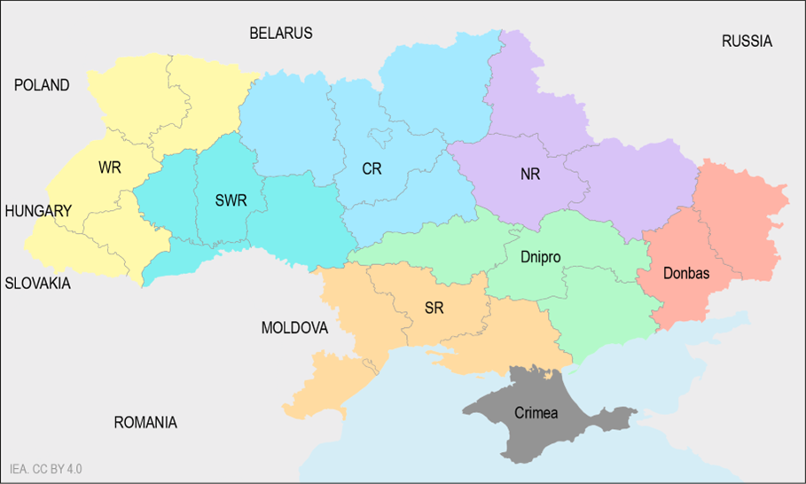
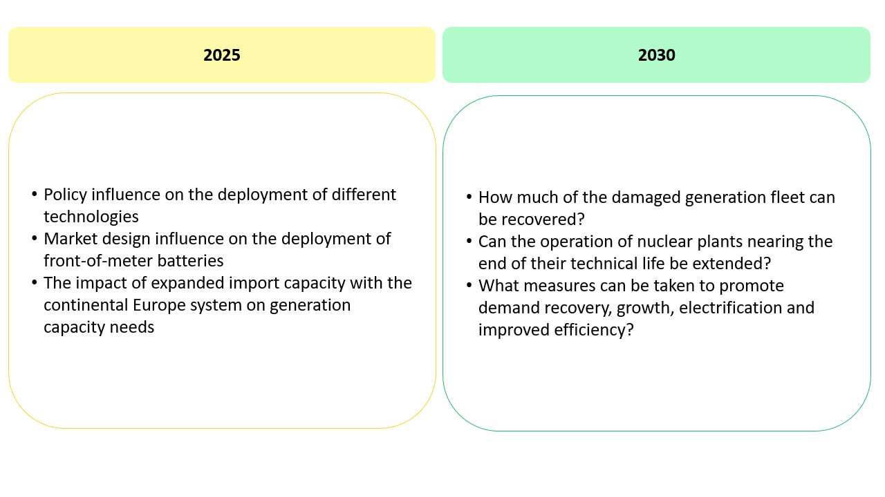

**Contents**

[[_TOC_]]

# **General Ukraine model background**

- **Regions**: The model represents Ukraine in 8 different regions based on the Ukrenergo Power Zones/Regions. While this includes Crimea, this is excluded by default as Crimea has not been part of the Ukrainian IPS since 2014. In addition to Ukraine, the model also represents its European neighbours and their neighbours at a nationally aggregated level. This is important to capture export/import opportunities and costs.

{width="437" height="263"}

- **Scenarios**: Muliple scenarios exist for both 2025 and 2030 across both the capacity expansion and production cost modules of PLEXOS. For the capacity expansion, the model looks at the least-cost expansion of DERs for addressing the power deficit in Ukraine due to the loss of generation capacity across 2023 and 2024, with sensitivities around the policy and regulation that can enable certain DER technologies. Meanwhile in 2030, a similar approach is taken however with the inclusion of a broader set of technologies and adding sensitivities on the recovery of both generation and demand. All models were then run in PCM to assess how the systems operate across the entire year to provide detailed information around costs, operations and system adequacy.

- **Generation**: Capacities come from data collected by a consultant (SEEPX) which contained information on technologies, fuels, heat rates, technical capabilities, plant age, etc as well as damage assessment (when available) and regional capacity as of July/August 2023. This was based on multiple data sources, including DTEK, the Ministry of Energy and public domain sources. Unfortunately, the exact sources are not provided by the consultant and there is an inconsistent level of detail across different generators (e.g. DTEK plants have very detailed information, others don't). The renewable generation capacity was also incomplete and had to be complemented by data from other sources including the Ministry of Energy itself and National Plan for RE (all of which are in the Data folder). In the case when only a national aggregate was given, this was split regionally according to existing capacities. In terms of damaged capacities, this was rather incomplete from SEEPX's data collection, and was updated with the use of a number of reports including the UNDP and KSE damage assessment reports and the Greenpeace Solar Marshall Plan (all can be found in the project folder under _Resources_.
- **Demand**: Electricity demand for Ukraine in the model is based on a combination of historical hourly profiles at a national level (-\>Sept 2022 from IEA DW RT data), regional snapshots of hourly demand on specific days before and after the invasion (provided by Ukrenergo and in the data folders), and future projections of annual and peak load growth (2025–2030) as per the Net Zero World Initiative’s Clean Energy Roadmap for Ukraine. These projections are divided into three scenarios – Business as Usual (BAU), Base Recovery (BR) and Intense Recovery (IR). Each scenario considers different levels of economic recovery, electrification and energy efficiency measures to achieve sectoral emission reductions While demand had been expected to recover between 2022 and 2025, this is assumed to be unlikely, given the escalation of attacks on the power system and Ukraine’s current power deficit. The modelled demand for 2025 is therefore assumed to be unchanged from 2023 levels and is set at 18.5 GW (a number from the [IEA's own report on the 2024/25 winter in Ukraine ](https://www.iea.org/reports/ukraines-energy-security-and-the-coming-winter), informed by expert opinion including [Green Deal Ukraina's excellent analysis](https://greendealukraina.org/products/analytical-reports/six-options-to-boost-power-grid-transfers-from-continental-europe-to-ukraine-for-the-next-two-winters).
  * Demand was built using a small Python Jupyter notebook, which is included in the [ModellingSuportFiles folder](%5Cvfilermc1%5CEMS%5CRED%5CModelling%5CUkraine%5C2023_UKR_ST_Security%5C09_ModellingSupportFiles) (this should probably be part of the plexos-model-setup even if maintaining it as a Jupyter Notebook)
- **Transmission**: The transmission capacity between each region is assumed based on existing lines between each region, assuming the transfer capacity based on the voltage level (using the surge impedance loading at each voltage level) and configuration of the lines. As the transmission system in Ukraine was traditionally designed to transmit electricity from east to west, it is assumed that the transfer capacity in this direction is half of the surge impedance loading. Additionally, due to the incurred damage to the transmission system since the full-scale invasion, it is assumed that the transfer capacity between regions has been compromised in the regions closest to the front line (Donbas, Dnipro and SR). In 2025 (and in all validation scenarios since the full-scale invasion), it is therefore assumed that transmission capacity between regions is reduced by a third between EOR and all other regions, also by a third between ER and SR, and by half between ER or SR and other regions.
  * While not reflected in the final model runs, the transmission between the Donbas region and the rest of the Ukraine IPS is believed to be almost destroyed so it could be even 5-10%!
- **European interconnection**: Inter-regional transmission and interconnection capacity to direct European neighbours (Hungary, Poland, Romania and Slovakia) are assumed based on available information around network infrastructure and transfer capacities between Ukraine and these neighbours in the modelled years, based on ENTSO-E input data for their European Resource Adequacy Assessment (ERAA) 2023 study. To represent the European market, all of Ukraine’s neighbours as well as their immediate neighbours (Austria, Bulgaria, Czechia, Germany, Hungary, Lithuania, Poland, Romania and Slovakia) are represented at a national level with generation represented at an aggregate level, considering the transfer capacity between each country. For the purpose of this modelling exercise, Moldova is not explicitly represented in order to limit the uncertainty related to the operation of the 2 520 MW Moldavskaya State District Power Plant (MGRES), Moldova’s largest power station, which is located in the breakaway region of Transnistria. However, Moldova’s network is considered as a transit route for power imports from and exports to Romania.
  * For validation models, the imposed limits for imports and exports to the European system are assumed based on the previous limits (as of February 2024) of 1 700 MW of imports and 500 MW of exports for the combined systems of Ukraine and Moldova. As Moldova has not been explicitly modelled, it is assumed that 200 MW of this capacity would be in use for its own electricity use. For 2025, the import limit from Europe increases to 2 100 MW in line with the recent announcement by ENTSO-E, and therefore the imposed limits are assumed to be 2 100 MW of imports and 500 MW of exports. For 2030, it is assumed that imports could be increased to 3 GW for Ukraine’s exclusive use while exports could be increased to 1 GW.
- **VRE profiles**: The locations for utility-scale solar and wind plants specified in the modelling scenarios are estimated using a wind and solar site selection methodology that considers the location of the best resource, annual demand in each region, proximity to existing transmission, terrain (i.e. slope and elevation) and protected areas, as well as current land use and land cover. In terms of existing plants, these sites are selected based on the location of these plants (by oblast) according to the collected data. In terms of sites for distributed solar PV, this was based on a bespoke dataset produced for the purpose this project by the Juelich Institute, which identified the technical potential of rooftops for solar PV. The selection of the appropriate sites from this dataset was based purely on random site selection from the available rooftops. Once the sites of both existing and future renewables were selected, a share of different PV and wind technologies were assumed for the utility-scale plants (as summarised in the report's Technical Annex.
  * Hourly renewable production profiles are then built using Atlite, aggregated by region and technology, based on ERA5 data from the European Centre for Medium-Range Weather Forecasts (ECMWF). In the case of wind production profiles, the ERA5 dataset is upscaled using the average wind speed data from the Global Wind Atlas. The weather year for the model is assumed to be 2021.
- **Market design**: Market design is not accurately reflected, however the limits of import/export markets are imposed by the ENTSOE IC limit. The ability of BESS (both BTM/FOM) to provide AS (regulation and spinning) is also controlled by certain scenarios.
- Useful files and locations
  - [Report](https://www.iea.org/reports/empowering-ukraine-through-a-decentralised-electricity-system)
  - [Project SP folder](https://ieaorg.sharepoint.com/:f:/r/sites/IEA-Ukraine/Shared%20Documents/General/Ukraine_DER_Roadmap?csf=1&web=1&e=gqYyHk)
  - [Launch slides](https://ieaorg.sharepoint.com/:p:/s/IEA-Ukraine/ESCZNZFgVA9Bjt7nHOh6JDgBCrdNjRJALvv1-trLJd0DZA)
  - Generator parameters sheet (Y:/Modelling\\Ukraine\\2023_UKR_ST_Security\\01_Data\\01_Generation\\20241113_generator_parameters_UKR.xlsx)

# **Capacity expansion model**

Unlike the majority of RISE PLEXOS models, which are almost exclusively production cost models (with the exception of the latest Thailand model and the Indonesia model, both of which use capacity expansion planning in a more limited manner), capacity expansion planning is central to the project model. The Corporate Procurement project models also use it extensively.

The capacity expansion planning is done in snapshots for both 2025 and 2030. This means that its not a comprehensive capacity expansion plan, which usually would model a 20year horizon and result in a build out based on demand growth, generation retirements and cost dynamics over that horizon. In this case, the assumption is that the snapshot year would continue for perpetuity, across the lifetime of all new investments.

Important inputs are build costs and financial inputs which are all summarised in the Technical Annex.  Also please look at appropriate material in PLEXOS on LT Plan within the Help File (press F1) or training material. Important settings include the performance object (which generally needs more time so a higher max time for solving a step, which in general is an entire year but also can have a higher MIP relative gap), the LT Plan object and others. In general, the capacity expansion plan done in RISE models was linear for capacity expansion but mixed integer for production. Refer to the setting objects for LT models for more information!  