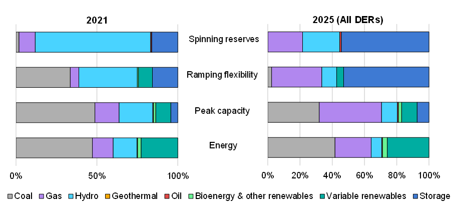

**Contents**

[[_TOC_]]

# **General Ukraine model background**

- **Regions**: The model represents Ukraine in 8 different regions based on the Ukrenergo Power Zones/Regions. While this includes Crimea, this is excluded by default as Crimea has not been part of the Ukrainian IPS since 2014. In addition to Ukraine, the model also represents its European neighbours and their neighbours at a nationally aggregated level. This is important to capture export/import opportunities and costs.

{width="437" height="263"}

- **Scenarios**: Muliple scenarios exist for both 2025 and 2030 across both the capacity expansion and production cost modules of PLEXOS. For the capacity expansion, the model looks at the least-cost expansion of DERs for addressing the power deficit in Ukraine due to the loss of generation capacity across 2023 and 2024, with sensitivities around the policy and regulation that can enable certain DER technologies. Meanwhile in 2030, a similar approach is taken however with the inclusion of a broader set of technologies and adding sensitivities on the recovery of both generation and demand. All models were then run in PCM to assess how the systems operate across the entire year to provide detailed information around costs, operations and system adequacy.


- **Generation**: Capacities come from data collected by a consultant (SEEPX) which contained information on technologies, fuels, heat rates, technical capabilities, plant age, etc as well as damage assessment (when available) and regional capacity as of July/August 2023. This was based on multiple data sources, including DTEK, the Ministry of Energy and public domain sources. Unfortunately, the exact sources are not provided by the consultant and there is an inconsistent level of detail across different generators (e.g. DTEK plants have very detailed information, others don't). The renewable generation capacity was also incomplete and had to be complemented by data from other sources including the Ministry of Energy itself and National Plan for RE (all of which are in the Data folder). In the case when only a national aggregate was given, this was split regionally according to existing capacities. In terms of damaged capacities, this was rather incomplete from SEEPX's data collection, and was updated with the use of a number of reports including the UNDP and KSE damage assessment reports and the Greenpeace Solar Marshall Plan (all can be found in the project folder under _Resources_.
- **Demand**: Electricity demand for Ukraine in the model is based on a combination of historical hourly profiles at a national level (-\>Sept 2022 from IEA DW RT data), regional snapshots of hourly demand on specific days before and after the invasion (provided by Ukrenergo and in the data folders), and future projections of annual and peak load growth (2025–2030) as per the Net Zero World Initiative’s Clean Energy Roadmap for Ukraine. These projections are divided into three scenarios – Business as Usual (BAU), Base Recovery (BR) and Intense Recovery (IR). Each scenario considers different levels of economic recovery, electrification and energy efficiency measures to achieve sectoral emission reductions While demand had been expected to recover between 2022 and 2025, this is assumed to be unlikely, given the escalation of attacks on the power system and Ukraine’s current power deficit. The modelled demand for 2025 is therefore assumed to be unchanged from 2023 levels and is set at 18.5 GW (a number from the [IEA's own report on the 2024/25 winter in Ukraine ](https://www.iea.org/reports/ukraines-energy-security-and-the-coming-winter), informed by expert opinion including [Green Deal Ukraina's excellent analysis](https://greendealukraina.org/products/analytical-reports/six-options-to-boost-power-grid-transfers-from-continental-europe-to-ukraine-for-the-next-two-winters).
  * Demand was built using a small Python Jupyter notebook, which is included in the [ModellingSuportFiles folder](%5Cvfilermc1%5CEMS%5CRED%5CModelling%5CUkraine%5C2023_UKR_ST_Security%5C09_ModellingSupportFiles) (this should probably be part of the plexos-model-setup even if maintaining it as a Jupyter Notebook)
- **Transmission**: The transmission capacity between each region is assumed based on existing lines between each region, assuming the transfer capacity based on the voltage level (using the surge impedance loading at each voltage level) and configuration of the lines. As the transmission system in Ukraine was traditionally designed to transmit electricity from east to west, it is assumed that the transfer capacity in this direction is half of the surge impedance loading. Additionally, due to the incurred damage to the transmission system since the full-scale invasion, it is assumed that the transfer capacity between regions has been compromised in the regions closest to the front line (Donbas, Dnipro and SR). In 2025 (and in all validation scenarios since the full-scale invasion), it is therefore assumed that transmission capacity between regions is reduced by a third between EOR and all other regions, also by a third between ER and SR, and by half between ER or SR and other regions.
  * While not reflected in the final model runs, the transmission between the Donbas region and the rest of the Ukraine IPS is believed to be almost destroyed so it could be even 5-10%!
- **European interconnection**: Inter-regional transmission and interconnection capacity to direct European neighbours (Hungary, Poland, Romania and Slovakia) are assumed based on available information around network infrastructure and transfer capacities between Ukraine and these neighbours in the modelled years, based on ENTSO-E input data for their European Resource Adequacy Assessment (ERAA) 2023 study. To represent the European market, all of Ukraine’s neighbours as well as their immediate neighbours (Austria, Bulgaria, Czechia, Germany, Hungary, Lithuania, Poland, Romania and Slovakia) are represented at a national level with generation represented at an aggregate level, considering the transfer capacity between each country. For the purpose of this modelling exercise, Moldova is not explicitly represented in order to limit the uncertainty related to the operation of the 2 520 MW Moldavskaya State District Power Plant (MGRES), Moldova’s largest power station, which is located in the breakaway region of Transnistria. However, Moldova’s network is considered as a transit route for power imports from and exports to Romania.
  * For validation models, the imposed limits for imports and exports to the European system are assumed based on the previous limits (as of February 2024) of 1 700 MW of imports and 500 MW of exports for the combined systems of Ukraine and Moldova. As Moldova has not been explicitly modelled, it is assumed that 200 MW of this capacity would be in use for its own electricity use. For 2025, the import limit from Europe increases to 2 100 MW in line with the recent announcement by ENTSO-E, and therefore the imposed limits are assumed to be 2 100 MW of imports and 500 MW of exports. For 2030, it is assumed that imports could be increased to 3 GW for Ukraine’s exclusive use while exports could be increased to 1 GW.
- **VRE profiles**: The locations for utility-scale solar and wind plants specified in the modelling scenarios are estimated using a wind and solar site selection methodology that considers the location of the best resource, annual demand in each region, proximity to existing transmission, terrain (i.e. slope and elevation) and protected areas, as well as current land use and land cover. In terms of existing plants, these sites are selected based on the location of these plants (by oblast) according to the collected data. In terms of sites for distributed solar PV, this was based on a bespoke dataset produced for the purpose this project by the Juelich Institute, which identified the technical potential of rooftops for solar PV. The selection of the appropriate sites from this dataset was based purely on random site selection from the available rooftops. Once the sites of both existing and future renewables were selected, a share of different PV and wind technologies were assumed for the utility-scale plants (as summarised in the report's Technical Annex.
  * Hourly renewable production profiles are then built using Atlite, aggregated by region and technology, based on ERA5 data from the European Centre for Medium-Range Weather Forecasts (ECMWF). In the case of wind production profiles, the ERA5 dataset is upscaled using the average wind speed data from the Global Wind Atlas. The weather year for the model is assumed to be 2021.
- **Market design**: Market design is not accurately reflected, however the limits of import/export markets are imposed by the ENTSOE IC limit. The ability of BESS (both BTM/FOM) to provide AS (regulation and spinning) is also controlled by certain scenarios.
- Useful files and locations
  - [Report](https://www.iea.org/reports/empowering-ukraine-through-a-decentralised-electricity-system)
  - [Project SP folder](https://ieaorg.sharepoint.com/:f:/r/sites/IEA-Ukraine/Shared%20Documents/General/Ukraine_DER_Roadmap?csf=1&web=1&e=gqYyHk)
  - [Launch slides](https://ieaorg.sharepoint.com/:p:/s/IEA-Ukraine/ESCZNZFgVA9Bjt7nHOh6JDgBCrdNjRJALvv1-trLJd0DZA)
  - Generator parameters sheet (Y:/Modelling\\Ukraine\\2023_UKR_ST_Security\\01_Data\\01_Generation\\20241113_generator_parameters_UKR.xlsx)

# **PLEXOS model scenarios**

The latest PLEXOS model for this project is UKR_Base_Model_v7.5_Roadmap_final.xml. The model has been cleaned up to delete most unwanted Model objects, with the remaining ones (including some unused sensitivities) included in appropriately named folders/categories. The main models are the following:

* UKR_Validation: Contains 2021 and 2024 (war-time) validations. Alternative wartime validation scenarios for 2023 can be found in the UKR_War_Scenario folder. Note that due to complications with side-by-side analysis with a leap year (**so a shortcoming of SFP!**), the 2024 validation uses 2023 as the year for this scenario (inputs for 2023 and 2024 demand are anyway assumed to be the same)
* UKR_CapExp_Runs\_{year}: CapExp runs and senstivities as used in the final runs. 
* UKR_Main\_{year}\_Scenarios: ST runs relating to each CapExp run, with certain senstitvities included. Sensitivies are mostly easily viewed via the Model/Scenario grid.

The remaining models are all test runs, and may play with certain other sensitivities that could be useful for future work.

**Note the nomenclature for model runs can be interpreted as follows:**

* e = expansion, where the letter following it corresponds to the technologies included. G=gas turbines/engines, S= solar+BTM battery, So = solar only,  Sc=constrained solar expansion (so based on limited supply chains or construction labour, etc), W=wind, B=utility-scale battery, Ba = constrained utility-scale batteries (1.5GW in 2025). The subscript **f** (e.g. Gf) denotes a fixed amount of that technology (e.g. fixed gas expansion) based on another scenario (e.g. 2025 case for all technologies would be used to determine the minimum amount of gas as seen in 2030). Note this Gf sensitivity wasnt used in the final runs. 
* CO2 = CO2 price included, Td = damaged transmission, Ix = expanded IC with EU, Rn = no repairs ahead of 2024/25 heating season (i.e. the same capacity as 2024), Ro = optimal 2025 capacity with all repairs remaining in operation (i.e 3GW thermal capacity), base 2025 scenario assumes only 1.5GW remains in operation at any one given time. 
* nBTo = no system optimisation of BTM batteries (see the representation of BTM BESS in the section on DERs below), ASb = batteries contribute to AS (note this didnt operate as expected, and batteries didnt provide reserves

# **Capacity expansion model**

Unlike the majority of RISE PLEXOS models, which are almost exclusively production cost models (with the exception of the latest Thailand model and the Indonesia model, both of which use capacity expansion planning in a more limited manner), capacity expansion planning is central to the project model. The Corporate Procurement project models also use it extensively.

The capacity expansion planning is done in snapshots for both 2025 and 2030. This means that its not a comprehensive capacity expansion plan, which usually would model a 20year horizon and result in a build out based on demand growth, generation retirements and cost dynamics over that horizon. In this case, the assumption is that the snapshot year would continue for perpetuity, across the lifetime of all new investments.

Important inputs are build costs and financial inputs which are all summarised in the Technical Annex. Also please look at appropriate material in PLEXOS on LT Plan within the Help File (press F1) or training material.

Important settings include the Performance object (which generally needs more time so a higher max time for solving a step, which in general is an entire year but also can have a higher MIP relative gap), the LT Plan object and others. As a summary, the following LT settings from the Ukraine-2023 model (as used in the LT_Sampled_3DaysPerMonth_UC object) are highlighted to bring them to your attention. Please see Help File or Trainings for more information:

* Chronology = Sampled, using 3 sample days per month: Approximates load by 3 sampled days, ensuring that both energy and max demand are preserved. The more days the more accurate, but the longer the simulation run time. Generally a number of different settings are tested to see which would be a good middle ground
* Expansion decisions integer optimality = Linear: Expansion can build non-integer number of units. In general, for VRE or BESS (which are scaleable) this is not a big deal. However for large-scale units this may need to be changed. One can control \[Expansion optimality\] on the generators themselves if mixing the two types. Integer decisions can make it much longer to solve, so again this boils down to trade-offs
* Co-optimise unit commitment: ensures that the UC is co-optimised with the expansion to ensure that least-cost decisions are taken that account for UC constraints. In reality, I am unsure exactly how this setting works, but it makes a huge difference in reducing USE that arises in the ST Schedule runs that are made after LT Plan
* Effective load approach: The basic premise behind the Effective Load Approach is to take the load and appropriately modify it with respect to the convolved capacity outages. It transposes the convolved generators forced outage rates into the LDC, effectively modifying the load to account for the capacity outages

For the expansion, a number of generic constraints were setup to ensure a fixed regional distribution of different technologies (e.g. wind, solar, rooftop solar). These could be informed by demand (for e.g. this is used for rooftop solar PV) or by the Site Selection tool, in an interative process (or based on certain tranches of capacity). In the Ukraine model, the several ratio constraints - regional ratio per technology, technology ratioes (e.g. wind to solar, roofttop to utility-scale) - were setup. These can be viewed from the Main models (as designated in the model).

**Finally**, the actual ST Schedule runs are not performed in sequential runs (i.e. via one PLEXOS model with LT, MT and ST all included). Instead, the LT Plan models are run, and then processed using the solution-files-processing function (as below). This adds 5% additional capacity across all technologies to account for the usually under-capacity representation when using sampled chronology that misses things like low VRE periods and/or periods of high maintenance/high outages. These are otuput to a specific location in the InputData folder for ExpUnits. **NOTE:** These are put in a \\NEW\\ folder to avoid unwanted overwriting.

```python
sfp.plots.extract_plexos_LT_results(config, scale=1.05)
```

This can be equally paired with the SFP functionality for a quick summary of LT results, saving time for checking results from LT Plan before commiting to hours of ST Schedule runs. This functionality is allowed by including the config.QUICK_PLOTS variables, which are chosen to use only results processed from annual summary plots (including that from LT Plan).

```python
sfp.plots.create_plot_2_summary(config, plot_vars=config.QUICK_PLOTS, plot_name='quick')
```

# **DER representation in the model**

With the model focus on DERs, this model was a test bed for new functionality in exploring the necessary regulation and market design to enable different DERs based on, for example, their ability to be controlled by TSOs or their ability to participate in AS markets.

For example, BTM batteries are explicitly included in the model. Although these are specifically community-scale batteries (which are assumed to be also batteries that could be deployed in industry), this really only had a bearing on the costs of these batteries (e.g. BTM batteries at residential level would be considerably higher while also harder to incentivise their reduction in peak consumption).

BTM batteries are implemented through a constraint on their load, which is \<= capacity factor of rooftop PV production in the region. This ensures that their implementation looks only at the ability to charge on production co-located with rooftop PV. Their operation, is also limited to discharge only during evening peak hours (18h-22h), to represent some sort of incentive for peak consumption reduction. 

Finally, the DERs are also limited in their ability to provide towards different reserves (spinning and regulating). These are also controlled through different senstitivies, though on final runs I found that their implementation was incorrect and batteries (in this case, utility-scale) didnt provide towards spinning reserves at all.  In the end, it didnt have a huge bearing on this model specifically as BESS was built for arbirtrage and peaking capacity needs while 1.4GW of PSH (1.7GW in 2030 after repairs to the damaged PSH unit)was able to provide towards the 1GW (based on the largest nuclear unit) spinning reserve requirements. 

###### Energy and service contributions of different technologies under different pathways to meet immediate system needs, 2021 vs. 2025

{width=437 height=195}

However, as reserve requirments increase with RE (due to regulating reserves), this would certainly need to be fixed and verified in future implementations of this. For example, in the services figure (seen below), only spinning reserves were analysed. **However, if looking also at balancing/regulating reserves, BESS could contribute a significant amount of this capacity which would otherwise be unrepresented**